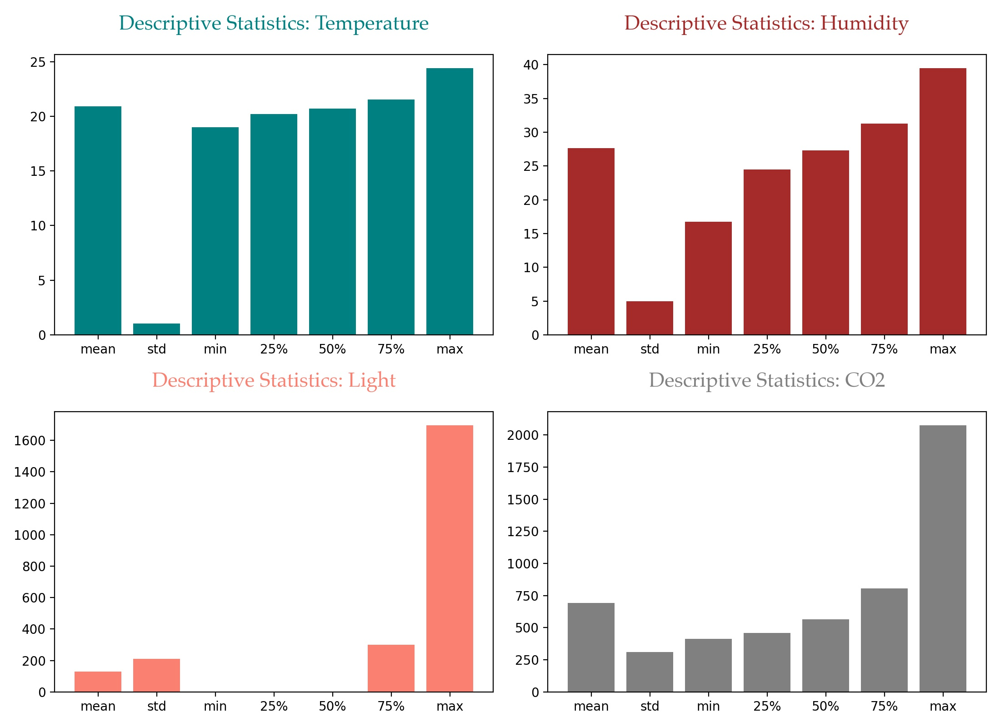
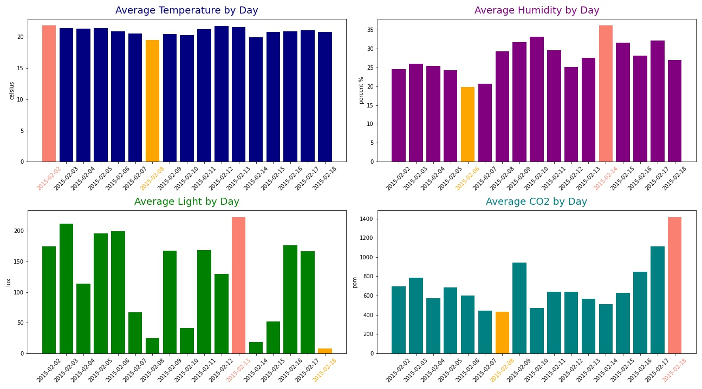
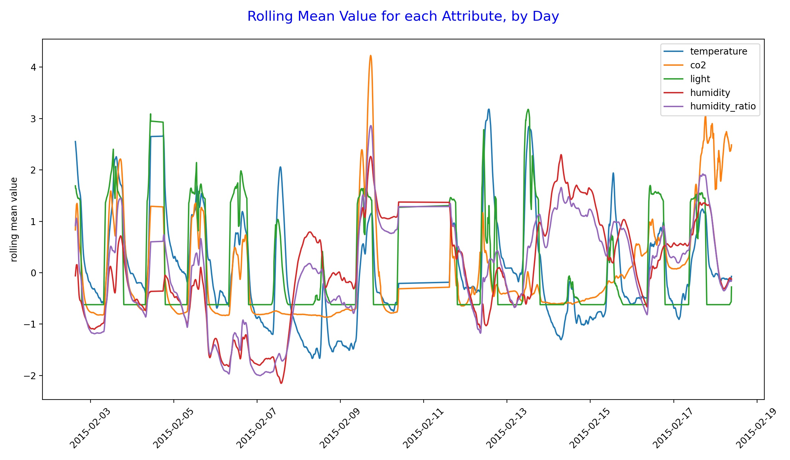

# Project 3

### Contents:
- [Problem Statement](#Problem-Statement)
- [Data Dictionary](#Data-Dictionary)
- [Brief Summary of Analysis](#Brief-Summary-of-Analysis)
- [Abstract Summary](#Abstract-Summary)
- [Conclusions and Recommendations](#Conclusions-and-Recommendations)

## Problem Statement

Toddler and teenage years are some of the most difficult years to navigate through for parents and children. A non-profit group of doctors and psychologists, called "Family matters", wants to better serve their community of parents by:
1. staying relevant and addressing current issues through articles, events, etc.
2. directing new calls and messages to the correct department for expert help

To achieve these goals, they would like to gain insight into what are some of the most common issues parents and their children curently talk about. With new insights gained, they hope to be able to provide better advice, write more relevant articles about issues discussed in the parenting community, and get a better understanding of what are some of the most common issues children face during these challenging years of physical and psychological development.

The organization would also like to improve their current customer service system to better handle calls and messages by directing new incoming requests from parents to the proper departments so they can be answered quicker and receive advice from experts in the domain, i.e. toddler vs. teenager.

I have been asked to gather relevant data, analyze it, and present my findings as they pertain to the organization's goals. My audience is comprised of high executives in charge of the organization, and a small group of doctors and psychologists who work directly with members of the community.

## Why is this important?

The organization is non-profit and looking to support families with educational materials, free consultations, and community events. It heavily relies on donations and volunteers. The parenting community is large and there is a wide variety of topics being discussed. Due to limited resources, it can be difficult to discuss every topic and address every request for assistance. By focusing on top major current issues and routing incoming requests to the correct departments, the organization is able to stay useful and relevant, thus attracting more donors, and provide quicker expert advice to incoming calls/messages, thus being able to assist more families.

## Data Dictionary

|Feature|Type|Description|
|---|---|---|
|title|object|Title of the post|
|selftext|object|Post content|
|class_target|int|1 if post is in r/toddlers and 0 if post is in r/Parenting|
|text|int|Merge of the title and selftext columns|
|title_char_count|int|The number of characters in the title|
|title_word_count|int|The number of words in the title (separator is white space)|
|selftext_char_count|int|The number of characters in the selftext|
|selftext_word_count|int|The number of words in the selftext|
|flair|object|Post tag to indicate topic addressed by a post|

## Brief Summary of Analysis

Using Reddit's API, pushshift.io, we retrieved a total of about 1,000 posts from two subreddits, r/toddlers and r/Parenting. According to the descriptions, the r/toddlers subreddit contains "Anything and everything relating to your toddler! A toddler is a child between 1 & 3 years old." The r/Parenting subreddit "is the place to discuss the ins and outs as well as ups and downs of child-rearing." We specifically focused on the "Teenager 13-19 Years" posts from the r/Parenting subreddit. The collected data was saved to the toddlers.csv file and teenagers.csv file, respectively.

Duplicate observations were removed.
Observations with no text in the title or the body of a post were removed.  
Numbers and underscores were removed.  
A few new features were engineered:  
text - merge result of title and selftext  
title_char_count - number of characters in the post title  
title_word_count - number of words in the post title  
self_char_count - number of characters in the post body  
self_word_count - number of words in the post body  

The clean data was saved to the subreddits.csv file.

We looked at the distribution of character and word counts for the title and body of the posts in each category and overall. The distributions are right skewed. Most post titles have a length between 25 and 50 characters, and contain between 5 and 9 words. 

We then looked at some of the most common used words across both categories of posts.

Are posts about teenager related topics longer than posts about toddler related topics? We found this to be true for our dataset.

Next we wanted to see what are the most used words for each class.

Top 10 Most Used Words in Teenager Posts compared to their usage in Toddler Posts.

Top 10 Most Used Words in Toddler Posts compared to their usage in Teenager Posts.

Top 10 words with significantly higher occurrences in Toddler posts than in Teenager Posts.

Top 10 words with significantly higher occurrences in Teenager posts than in Toddler Posts.

There is no significant difference in sentiment between the two categories. Most posts are neutral.

To narrow down top topics we used a method called text blob, which allowed us to extract noun phrases as they provided more context than single words.  

Top 25 topics discussed in the Toddler posts.

Top 25 topics discussed in the Teenager posts.

With our first problem answered, we proceeded to designing models that can accurately classify a post into one of the two categories: toddler (1) or teenager (0). Stop words, along with words such as 'teenager', 'toddler', 'teenagers', 'toddlers', and other less-significant words were removed before creating these models. In the figures below, we have four boxes that can be interpreted as follows, from left to right:
- title provides the name of the model/estimator used followed by the name of the transformer used
- first row in the box shows us how many of the posts predicted as teenager (0) were predicted correctly and how many were not: 240 were predicted correctly as class 0 (i.e. teenager post from the r/Parenting subreddit) and 10 were predicted incorrectly as being class 0
- second row in the box shows us how many of the posts predicted as toddler posts (class 1) were predicted incorrectly and how many were correct: 23 were predicted incorrectly as class 1, and 220 were predicted correctly as class 1 (i.e. toddler post from the r/toddlers subreddit)

When comparing/evaluating models, we need to be familiar with a few metrics.  

**Sensitivity** measures the proportion of positives that are correctly identified.  
**Specificity** measures the proportion of negatives that are correctly identified.  
**Accuracy** tells us about the number of correctly classified data points with respect to the total data points. As the name suggests, accuracy talks about how close the predicted values are to the target values.  
**Precision** expresses the proportion of the data points our model says was relevant actually were relevant.

Below is a summary of scores for each of the models created for this purpose.

|             |   NB with CV |   NB with TFIDF |   LR with CV |   LR with TFIDF |   RF with CV |   RF with TFIDF |   SVC with CV |   SVC with TFIDF |
|:------------|-------------:|----------------:|-------------:|----------------:|-------------:|----------------:|--------------:|-----------------:|
| best score  |       0.95   |          0.9506 |       0.9297 |          0.9432 |       0.8939 |          0.9108 |        0.8783 |           0.9446 |
| train score |       0.9784 |          0.9797 |       0.998  |          0.9885 |       0.9432 |          1      |        0.9675 |           1      |
| test score  |       0.9331 |          0.9189 |       0.9087 |          0.9209 |       0.8844 |          0.8966 |        0.8905 |           0.927  |
| sensitivity |       0.9053 |          0.9095 |       0.893  |          0.9136 |       0.8683 |          0.9506 |        0.8848 |           0.9259 |
| specificity |       0.96   |          0.928  |       0.924  |          0.928  |       0.9    |          0.844  |        0.896  |           0.928  |
| precision   |       0.9565 |          0.9247 |       0.9195 |          0.925  |       0.8941 |          0.8556 |        0.8921 |           0.9259 |
| accuracy    |       0.9331 |          0.9189 |       0.9087 |          0.9209 |       0.8844 |          0.8966 |        0.8905 |           0.927  |

 

|Abbreviation|Meaning|
|---|---|
|CV|Count Vectorizer|
|NB|Multinomial Naive Bayes|
|TFIDF|Tfidf Vectorizer|
|LR|Logistic Regression|
|RF|Random Forest Classifier|
|SVC|Support Vector Classifier|

 

In our case, we are aiming to classify posts as accurately as possible, so we have chosen to optimize for accuracy. The best model in this case is the first model with highest accuracy of 93%.

The parameters used for our best model:  

|Parameter Name|Parameter Value|
|---|---|
|max_df|0.9| 
|max_features|4000|
|min_df|2|
|ngram_range|(1, 1)|

 

|Variable Name|Coefficient Value|
|---|---|
|orchestra|-11.414816|
|boston|-11.414816|
|match|-11.414816|
|bothered|-11.414816|
|marry|-11.414816|
|marriage|-11.414816|
|manipulative|-11.414816|
|borrowed|-11.414816|
|manipulation|-11.414816|
|mall|-11.414816|

## Abstract Summary

This report provides an analysis into most current topics of interest in the parenting community and new models for improving the current system of routing new incoming requests from the community. Methods of analysis include Natural Language Processing techniques and Classification Models. Details about the methods used can be found in the appendices. 

Our data analysis shows that the most common topics discussed by parents raising toddlers are: potty training, nap time, speech therapy, falling asleep, car seat, toddler bed, day care, and family members. Most common topics discussed by parents raising teenagers are: high school, video games, social media, middle school, birth control, and mental health. Our staff of volunteers can use this information to create more up to date and relevant content, and have more meaningful discussions with parents and children.

The model we built can be implemented by the IT department to direct incoming requests from our parenting community to the correct department, thus allowing the staff with the proper subject matter expertise to respond more efficiently.

Recommendations discussed include:
1. Focus resources on developing materials (i.e. books, website content, events) that discuss current issues in the community as highlighted above.
2. Train new volunteers on addressing these topics when reaching out to the community through education or consulting.
3. Implement our classification model into a new system for routing incoming requests from the community.

## Conclusions and Recommendations

**Conclusions:**  

1. We recommend that staff specializing in toddlers focus on the following topics when creating content or in their conversations with parents: potty training, nap time, speech therapy, falling asleep, car seat, toddler bed, day care, and family members.
2. We recommend that staff specializing in teenagers focus on the following topics when creating content or in their conversations with parents: high school, video games, social media, middle school, birth control, and mental health.
3. We recommend the IT department implement our model to improve the current routing system for incoming requests from the community.

**Next steps:**  

Gather more data and consider additional detail, such as comments from the Reddit posts. Consider working more closely with other departments of the organization, i.e. medical staff and public relations, to get a better understanding of the domain, and brainstorm on what other sources of data may be useful and could provide additional insight into major topics. Tune the model, and look into acquiring more funds and computational resources which could allow for more models to be built, run, and evaluated.

**Resources:**

(1) [Sensitivity and Specificity](https://en.wikipedia.org/wiki/Sensitivity_and_specificity)  
(2) [Accuracy](https://towardsdatascience.com/how-to-evaluate-machine-learning-model-performance-in-python-135b4ae27f7e)  
(3) [Precision](https://towardsdatascience.com/beyond-accuracy-precision-and-recall-3da06bea9f6c)  
(4) [Executive Summary](https://unilearning.uow.edu.au/report/4bi1.html)  
(5) [How to Predict Room Occupancy Based on Environmental Factors](https://machinelearningmastery.com/how-to-predict-room-occupancy-based-on-environmental-factors/)  
(6) [Technical Report and Project](https://github.com/CristinaSahoo/Capstone.git)
(7) [Improving Prediction of Office Room Occupancy Through Random Sampling](https://www.datasciencecentral.com/m/blogpost?id=6448529%3ABlogPost%3A508623)
(8) [Occupancy](https://www.scikit-yb.org/en/latest/api/datasets/occupancy.html)
(9) [Room Occupancy Detection](http://www.renom.jp/notebooks/tutorial/clustering/occupancy-detection/notebook.html)
(10) [Classroom Occupancy Project](https://www.slideshare.net/mobile/MengdiYue/classroom-occupancy-project)
(11) [Accurate occupancy detection of an office room from light, temperature, humidity and CO2 measurements using statistical learning models. Luis M. Candanedo, Véronique Feldheim. Energy and Buildings. Volume 112, 15 January 2016, Pages 28-39.](https://drive.google.com/drive/folders/1tlRKY3LTSvG7gLD5eubW2i3sAtZtVfMh?usp=sharing)

**Data Sources:**  

(1) [Occupancy Detection Dataset](http://archive.ics.uci.edu/ml/datasets/Occupancy+Detection+#)