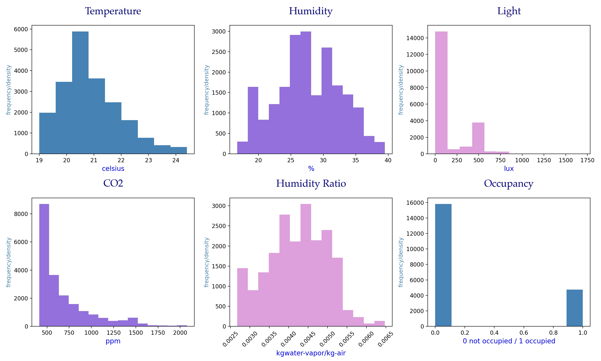
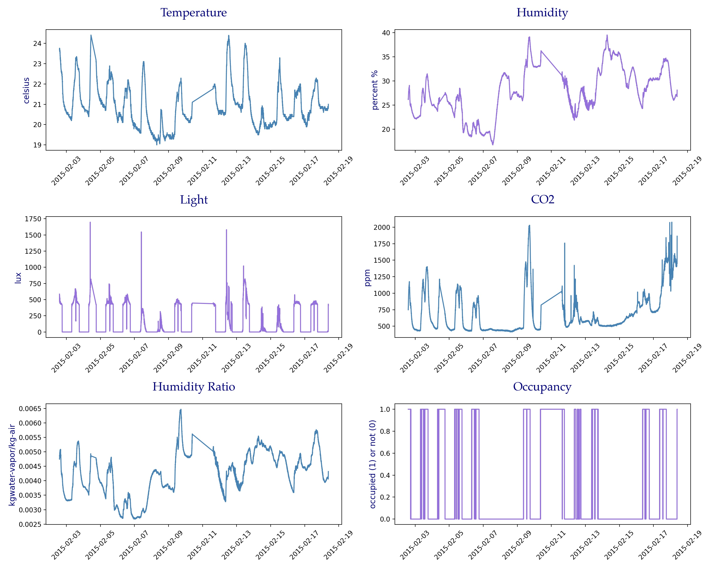
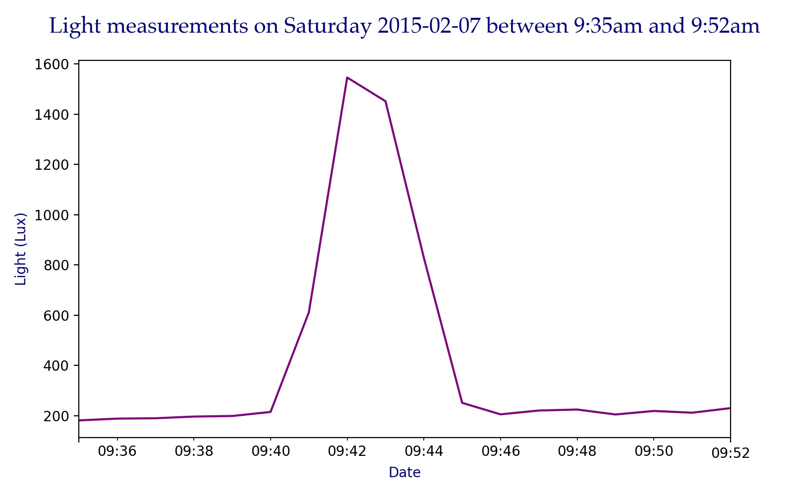
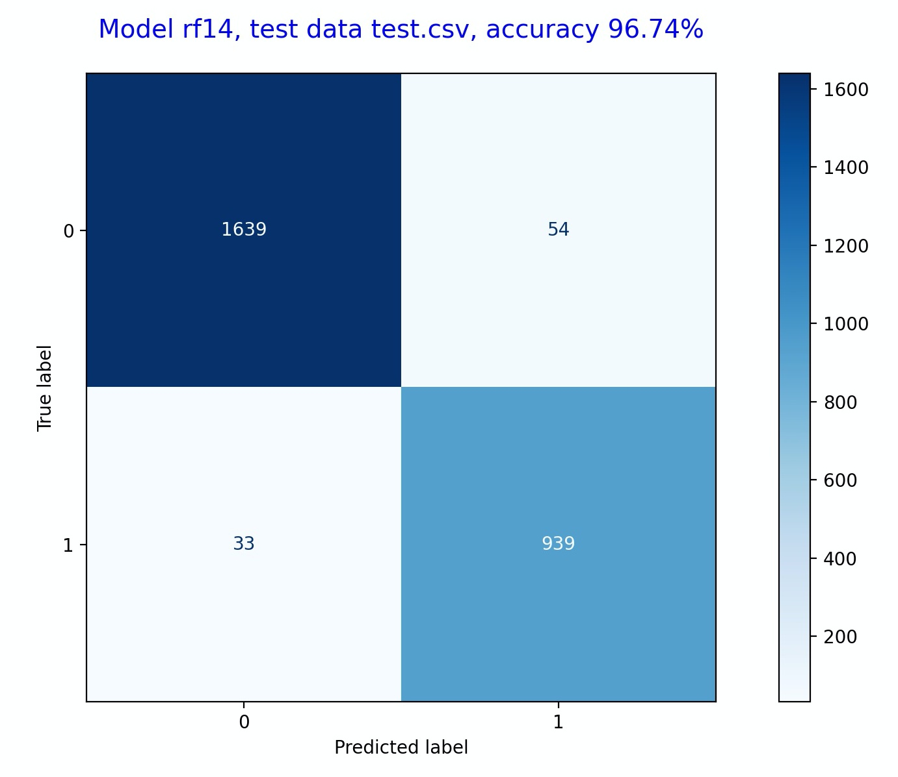
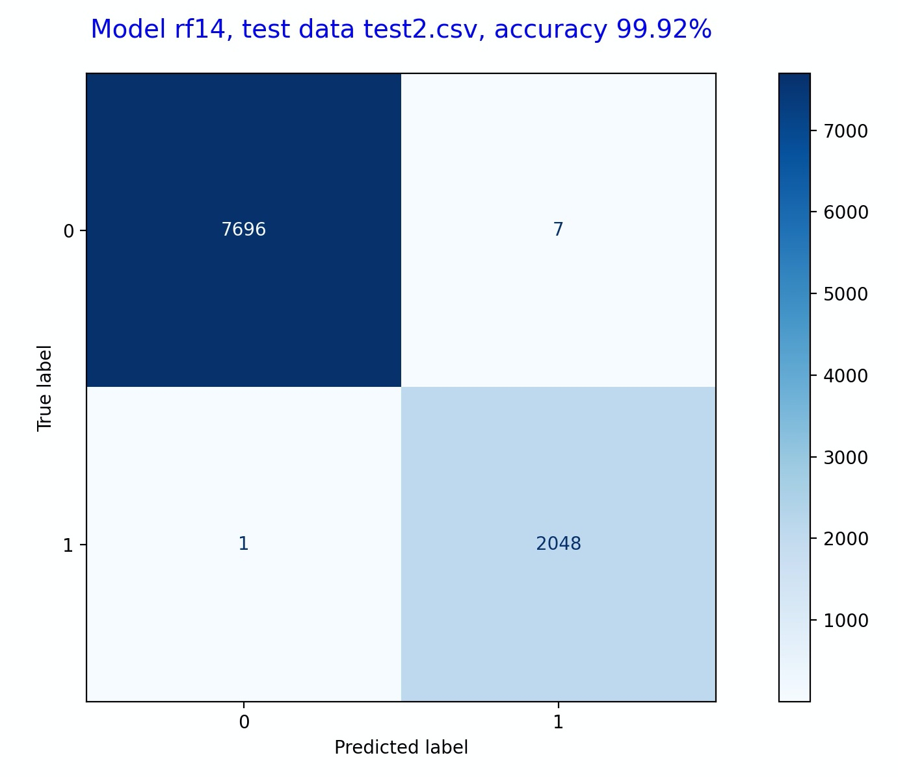

# Occupancy Detection

### Contents:
- [Problem Statement](#Problem-Statement)
- [Data Dictionary](#Data-Dictionary)
- [Brief Summary of Analysis](#Brief-Summary-of-Analysis)
- [Abstract Summary](#Abstract-Summary)
- [Conclusions and Recommendations](#Conclusions-and-Recommendations)

## Problem Statement

## Why is this important?

The accurate determination of occupancy detection in buildings has been recently estimated to save energy in the order of 30 to 42% *[12–14]*. Experimental measurements reported that energy savings were 37% in *[15]* and between 29% and 80% *[16]* when occupancy data was used as an input for HVAC control algorithms. Nowadays, with the affordability of sensors increasing and becoming more ubiquitous, together with affordable computing power for automation systems it makes the determination of occupancy a very promising approach to lower energy consumption by appropriate control of HVAC and lighting systems in buildings. Other applications for occupancy detection include security and determination of building occupant behaviors. A system that could accurately detect the presence of the occupants without using a camera is very interesting due to privacy concerns.

## Data Dictionary

|Feature Name|Feature Description|Units of Measurement or Format|
|---|---|---|
|date|time the observation was recorded|year-month-day hour:minute:second|
|temperature|temperature recorded|Celsius|
|humidity|relative humidity recorded|%|
|light|light recorded at time of observation|Lux|
|co2|CO2 measured at the time of observation|ppm, parts per million|
|humidity_ration|derived quantity from temperature and relative humidity|kgwater-vapor/kg-air|
|occupancy|status of room occupancy|0 for not occupied, 1 for occupied status|
|weekday|indicates if the timestamp is weekday or weekend| 1 for weekday, 0 for weekend|

## Brief Summary of Analysis

**Data Cleaning and Feature Engineering/Pre-Processing.**  

Three datasets were provided:  
- datatraining.txt
- datatest.txt
- datatest2.txt

Attribute names were modified to follow snake casing. Timestamps were cleaned by rounding up :59 to 00. A new feature was created to indicate whether the date corresponded to a weekday or to a weekend day. Observations were sorted by date, from the earliest timestamp to the latest. Data was indexed by timestamps, which allowed for time series type EDA, in addition to regular EDA. This provided me with an opportunity to observe how measurements changed over time.

After cleaning and feature engineering/pre-processing, the datasets were saved into two formats, .csv and .p. Both file formats contain the clean data in time series format, where the index is the date, however .p files contain the additional feature, weekday. I saved each dataset individually, but also created a larger dataset with included all of the data in the three datasets, cleaned it as described above, and saved it in .csv and .p format.

The resulting files after cleaning and feature engineering are:  
- occupancy.csv and occupancy.p (combined data)  
- train.csv and train.p (datatraining.txt)
- test.csv and test.p (datatest.txt)
- test2.csv and test2.p (datatest2.txt)  

|Dataset|Description|Dimensions|Class Distribution (class 0 to class 1)|
|---|---|---|---|
|occupancy|combined data|17895, 7|78.88% to 21.11%|
|train|training data|8143, 7|78.76% to 21.23%|
|test|testing data, door open|2665, 7|63.52% to 36.47%|
|test2|testing data, door closed|9752, 7|78.98% to 21.01%|

**Exploratory Data Analysis was performed on the combined data, occupancy.**

Descriptive Statistics.

Class Distribution.

Histograms.

*Temperature: right-skewed (positive skewness)    
CO2: right-skewed (positive skewness)    
Humidity_ratio: right-skewed (positive skewness)*. 

Measurements over time.

*There is data missing for 2/11, so we observe a gap in the time series.  
There are some spikes in light measurement on 2/7 and 2/12 which we will review in detail later.*. 

Light measurements, Thursday 2/12 vs Friday 2/14.

*Light values measured on Thursday are higher than Saturday light measurements.*

  

**Model training, evaluation, and summary.**  

Models were trained on a split of 75% training to 25% testing of the combined data. The results show that inlcuding the 'weekday' feature improves the accuracy of the models. The models used were Random Forest (RF), Linear Discriminant Analysis (LDA), Classification and Regression Trees (CART), Gradient Boosting Machine (GBM), K-Nearest Neighbor (KNN), Support Vector Classification (SVC), and Adaptive Boosting (AdaBoost). When the 'weekday' feature was included, Random Forest and Gradient Boosting Machine models performed with the highest accuracy levels.

63 models were run on different combinations of the original features provided in the datasets: temperature, humidity, light, co2, humidity_ratio. A summary of all models and their corresponding features and scores can be found in the scores.csv file.

154 models were run on different combinations of the original features and the newly engineered feature, 'weekday'. A summary of all models and their corresponding features and scores can be found in the scores2.csv file.

A total of 217 models were run. The best model was Random Forest on the following features: temperature, humidity, light, humidity_ratio, weekday. At training time, the model reported 99.60% accuracy on a 75/20 train/test split of combined data, i.e. occupancy. For test data, with door open, the accuracy reported was 96.74% and for test2 data, with door closed, the accuracy reported as 99.72%.

Model name: Random Forest  
Features used: temperature, humidity, light, humidity_ratio, weekday  
Testing data: test

Model name: Random Forest  
Features used: temperature, humidity, light, humidity_ratio, weekday  
Testing data: test2

 

When comparing/evaluating models, we need to be familiar with a few metrics.  

**Sensitivity** measures the proportion of positives that are correctly identified.  
**Specificity** measures the proportion of negatives that are correctly identified.  
**Accuracy** tells us about the number of correctly classified data points with respect to the total data points. As the name suggests, accuracy talks about how close the predicted values are to the target values.  
**Precision** expresses the proportion of the data points our model says was relevant actually were relevant.

For the purpose of this project, accuracy is used to rate the models from best to worst. Below are the top 10 models that had highest accuracy, all above 99%. 

|    | Model name   | Features                                                   |   Best score |   Train score |   Test score |   Sensitivity |   Specificity |   Precision |   Accuracy |   F1-score |
|---:|:-------------|:-----------------------------------------------------------|-------------:|--------------:|-------------:|--------------:|--------------:|------------:|-----------:|-----------:|
| 14 | rf14         | temperature, humidity, light, humidity_ratio, weekday      |       0.994  |        0.9996 |       0.996  |        0.9905 |        0.9974 |      0.9905 |     0.996  |     0.9905 |
| 12 | rf12         | temperature, humidity, light, co2, weekday                 |       0.9945 |        1      |       0.9958 |        0.9894 |        0.9974 |      0.9905 |     0.9958 |     0.9899 |
| 11 | rf11         | temperature, humidity, light, co2, humidity_ratio, weekday |       0.9946 |        1      |       0.9955 |        0.9905 |        0.9969 |      0.9884 |     0.9955 |     0.9894 |
|  1 | rf1          | temperature, humidity, light, co2                          |       0.994  |        1      |       0.9955 |        0.9884 |        0.9974 |      0.9905 |     0.9955 |     0.9894 |
|  0 | rf0          | temperature, humidity, light, co2, humidity_ratio          |       0.9938 |        1      |       0.9953 |        0.9873 |        0.9974 |      0.9904 |     0.9953 |     0.9889 |
| 77 | gbm11        | temperature, humidity, light, co2, humidity_ratio, weekday |       0.994  |        1      |       0.9951 |        0.9884 |        0.9969 |      0.9884 |     0.9951 |     0.9884 |
| 67 | gbm1         | temperature, humidity, light, co2                          |       0.9932 |        0.9989 |       0.9949 |        0.9873 |        0.9969 |      0.9883 |     0.9949 |     0.9878 |
| 18 | rf18         | humidity, light, weekday                                   |       0.992  |        0.9994 |       0.9949 |        0.9884 |        0.9966 |      0.9873 |     0.9949 |     0.9878 |
|  3 | rf3          | temperature, humidity, light, humidity_ratio               |       0.9931 |        0.9996 |       0.9944 |        0.9831 |        0.9974 |      0.9904 |     0.9944 |     0.9867 |
| 66 | gbm0         | temperature, humidity, light, co2, humidity_ratio          |       0.993  |        1      |       0.9944 |        0.9862 |        0.9966 |      0.9873 |     0.9944 |     0.9868 |

 

|Abbreviation|Meaning|
|---|---|
|RF|Random Forest|
|LDA|Linear Discriminant Analysis|
|GBM|Gradient Boosting Machine|
|AdaBoost|Adaptive Boosting|
|KNN|K-Nearest Neighbor|
|SVC|Support Vector Classification|

 

The best parameters used for our best model, after gridsearch, are below:  

|Parameter Name|Parameter Value|
|---|---|
|max_depth| None|
|max_features| auto|
|n_estimators| 100|

 

## Abstract Summary

The accuracy of the prediction of occupancy in an office room using data from light, temperature, humidity and CO2 sensors has been evaluated with different statistical classification models using Python. Three data sets were used in this work, one for training, and two for testing the models considering the office door opened and closed during occupancy. The datasets were combined into one large dataset. The data was cleaned, and exploratory data analysis was performed on it. The models were trained on a split of 75% train to 25% test of the combined dataset. The data sets provided for testing, with door open and door closed, were used to generate predictions and further evaluate the models.

A total of 217 models were run. The best model was Random Forest on the following features: temperature, humidity, light, humidity_ratio, weekday. At training time, the model reported 99.60% accuracy on a 75/20 train/test split of combined data, i.e. occupancy. For test data, with door open, the accuracy reported was 96.74% and for test2 data, with door closed, the accuracy reported as 99.72%.

## Conclusions and Recommendations

**Conclusions:**  

**Next steps:**  

**Resources:**

(1) [Sensitivity and Specificity](https://en.wikipedia.org/wiki/Sensitivity_and_specificity)  
(2) [Accuracy](https://towardsdatascience.com/how-to-evaluate-machine-learning-model-performance-in-python-135b4ae27f7e)  
(3) [Precision](https://towardsdatascience.com/beyond-accuracy-precision-and-recall-3da06bea9f6c)  
(4) [Executive Summary](https://unilearning.uow.edu.au/report/4bi1.html)  
(5) [How to Predict Room Occupancy Based on Environmental Factors](https://machinelearningmastery.com/how-to-predict-room-occupancy-based-on-environmental-factors/)  
(6) [Technical Report and Project](https://github.com/CristinaSahoo/Capstone.git)  
(7) [Improving Prediction of Office Room Occupancy Through Random Sampling](https://www.datasciencecentral.com/m/blogpost?id=6448529%3ABlogPost%3A508623)  
(8) [Occupancy](https://www.scikit-yb.org/en/latest/api/datasets/occupancy.html)  
(9) [Room Occupancy Detection](http://www.renom.jp/notebooks/tutorial/clustering/occupancy-detection/notebook.html)  
(10) [Classroom Occupancy Project](https://www.slideshare.net/mobile/MengdiYue/classroom-occupancy-project)  
(11) [Accurate occupancy detection of an office room from light, temperature, humidity and CO2 measurements using statistical learning models. Luis M. Candanedo, Véronique Feldheim. Energy and Buildings. Volume 112, 15 January 2016, Pages 28-39.](https://drive.google.com/drive/folders/1tlRKY3LTSvG7gLD5eubW2i3sAtZtVfMh?usp=sharing)  
(12) [Calculate day in the past](https://www.calculator.net/day-of-the-week-calculator.html?today=02%2F07%2F2015&x=78&y=24)  
(13) [V.L.Erickson, M.Á.Carreira-Perpinán, A.E.Cerpa, OBSERVE:Occupancy-based system for efficient reduction of HVAC energy, in: Proceedings of the 10th International Conference on, IEEE, Information Processing in Sensor Networks (IPSN), Chicago, IL, 2011, pp. 258–269.](http://refhub.elsevier.com/S0378-7788(15)30435-7/sbref0200)  
(14) [V.L.Erickson, M.Á.Carreira-Perpinán, A.E.Cerpa,Occupancy modeling and prediction for building energy management, ACM Trans. Sensor Netw. (TOSN) 10 (3) (2014) 42.](http://refhub.elsevier.com/S0378-7788(15)30435-7/sbref0205)  
(14) Dong B., Andrews B., (2009). Sensor-based occupancy behavioral pattern recognition for energy and comfort management in intelligent buildings. Proceedings of Building Simulation.  
(15) [J. Brooks, S. Goyal, R. Subramany, Y. Lin, T. Middelkoop, L. Arpan, L. Carloni, P. Barooah, An experimental investigation of occupancy-based energy-efficient control of commercial building indoor climate, in: Proceeding of the IEEE 53rd Annual Conference on, IEEE, Decision and Control (CDC), Los Angeles, CA, 2014, pp. 5680–5685.](http://refhub.elsevier.com/S0378-7788(15)30435-7/sbref0215)  
(16) [J. Brooks, S. Kumar, S. Goyal, R. Subramany, P. Barooah, Energy-efficient control of under-actuated HVAC zones in commercial buildings, Energy Build. 93 (2015) 160–168.](http://refhub.elsevier.com/S0378-7788(15)30435-7/sbref0220)  

**Data Sources:**  

(1) [Occupancy Detection Dataset](http://archive.ics.uci.edu/ml/datasets/Occupancy+Detection+#)