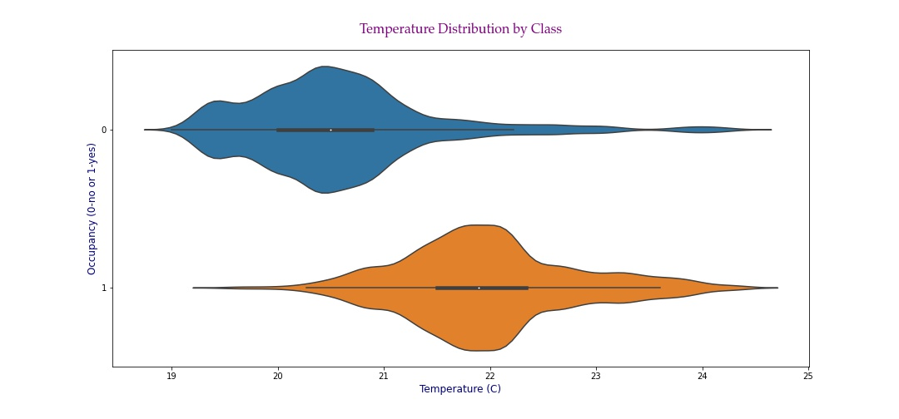
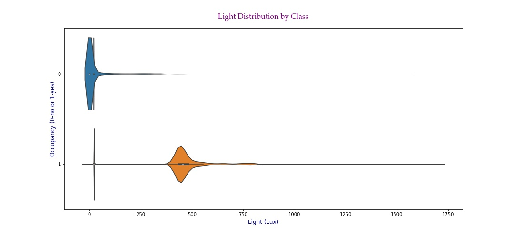
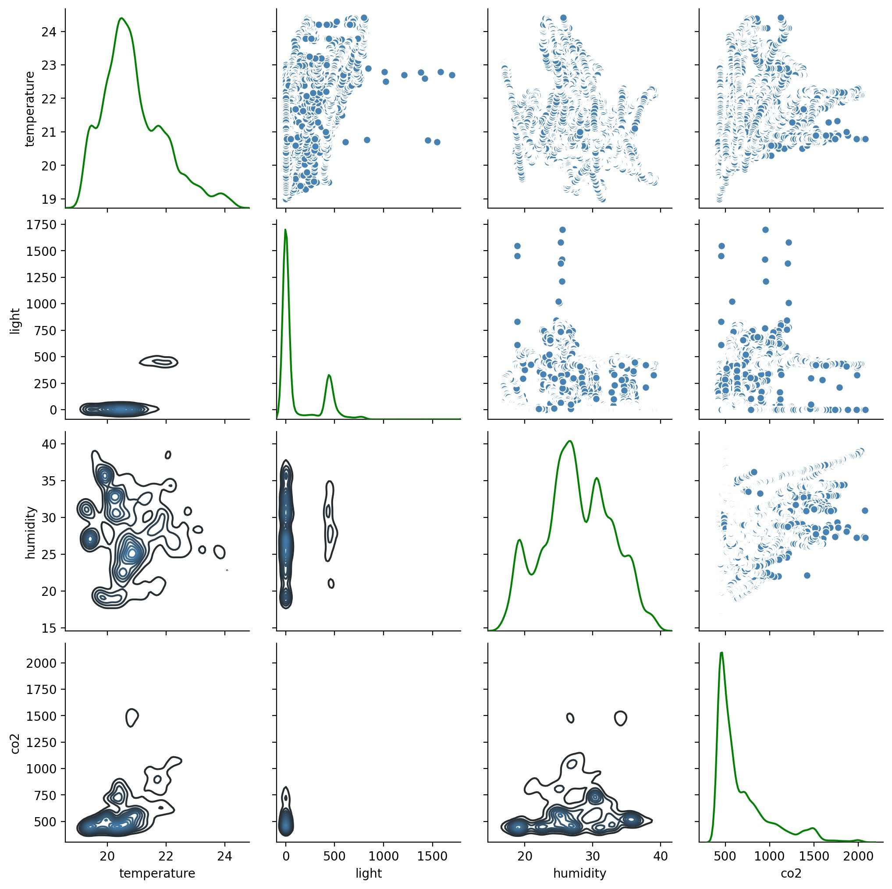
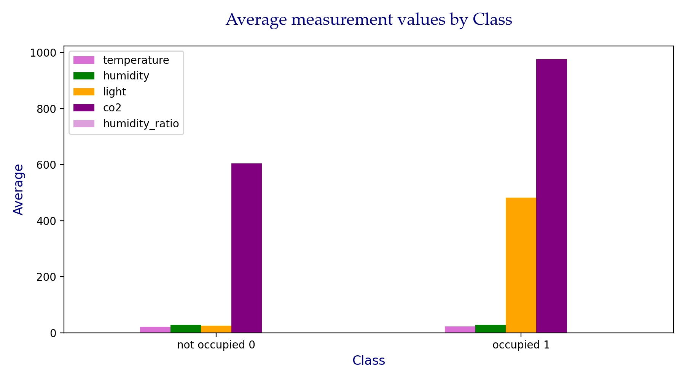
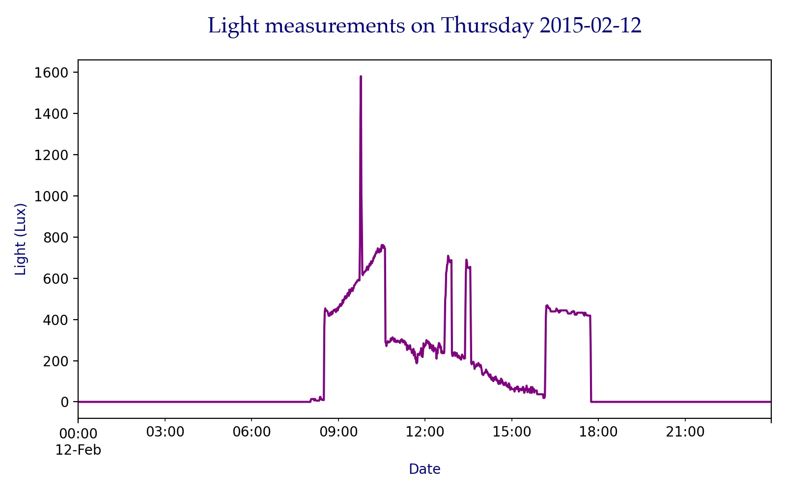

# Occupancy Detection

### Contents:
- [Problem Statement](#Problem-Statement)
- [Data Dictionary](#Data-Dictionary)
- [Brief Summary of Analysis](#Brief-Summary-of-Analysis)
- [Abstract Summary](#Abstract-Summary)
- [Conclusions and Recommendations](#Conclusions-and-Recommendations)

## Problem Statement

Environment variables, i.e. temperature, light, CO2, and humidity were measured over a period of two weeks, from 02/04/2015 to 02/18/2015, in an office room, in Mons, Belgium, during the month of February. The humidity ratio was calculated from temperature and relative humidity. The aim of this project is to:

1) explore the data to *identify trends over time*, and answer questions such as: Are CO2 values higher during the weekend compared to weekdays? Does light play an important role when predicting occupancy? Are temperature measurements reporting higher values during the week or during the weekend? How correlated is each of the environment variables to occupancy? How correlated is each of these variables to the others? Does the day of the week, i.e. weekday vs. weekend, play an important role in predicting occupancy? Are average values higher or lower when the room is occupied?

2) automate the model building and testing process to allow the creation of 200+ models and *identify the best algorithm* that predicts occupancy from these environment variables.

## Why is this important?

The accurate determination of occupancy detection in buildings has been recently estimated to save energy in the order of 30 to 42% *[13–15]*. Experimental measurements reported that energy savings were 37% in *[16]* and between 29% and 80% *[17]* when occupancy data was used as an input for HVAC control algorithms. Nowadays, with the affordability of sensors increasing and becoming more ubiquitous, together with affordable computing power for automation systems it makes the determination of occupancy a very promising approach to lower energy consumption by appropriate control of HVAC and lighting systems in buildings. Other applications for occupancy detection include security and determination of building occupant behaviors. A system that could accurately detect the presence of the occupants without using a camera is very interesting due to privacy concerns.

## Data Dictionary

|Feature Name|Feature Description|Units of Measurement or Format|
|---|---|---|
|date|time the observation was recorded|year-month-day hour:minute:second|
|temperature|temperature recorded|Celsius|
|humidity|relative humidity recorded|%|
|light|light recorded at time of observation|Lux|
|co2|CO2 measured at the time of observation|ppm, parts per million|
|humidity_ratio|derived quantity from temperature and relative humidity|kgwater-vapor/kg-air|
|occupancy|status of room occupancy|0 for not occupied, 1 for occupied status|
|weekday|indicates if the timestamp is weekday or weekend| 1 for weekday, 0 for weekend|

## Brief Summary of Analysis

**Data Cleaning and Feature Engineering/Pre-Processing.**  

Three datasets were provided:  
- datatraining.txt
- datatest.txt
- datatest2.txt

Attribute names were modified to follow snake casing. Timestamps were cleaned by rounding up :59 to 00. A new feature was created to indicate whether the date corresponded to a weekday or to a weekend day. Observations were sorted by date, from the earliest timestamp to the latest. Data was indexed by timestamps, which allowed for time series type EDA, in addition to regular EDA. This provided me with an opportunity to observe how measurements changed over time.

After cleaning and feature engineering/pre-processing, the datasets were saved into two formats, .csv and .p. Both file formats contain the clean data in time series format, where the index is the date, however .p files contain the additional feature, weekday. I saved each dataset individually, but also created a larger dataset with included all of the data in the three datasets, cleaned it as described above, and saved it in .csv and .p format.

The resulting files after cleaning and feature engineering are:  
- occupancy.csv and occupancy.p (combined data)  
- train.csv and train.p (datatraining.txt)
- test.csv and test.p (datatest.txt)
- test2.csv and test2.p (datatest2.txt)  

|Dataset|Description|Dimensions|Class Distribution (class 0 to class 1)|
|---|---|---|---|
|occupancy|combined data|17895, 7|76.89% to 23.10%|
|train|training data|8143, 7|78.76% to 21.23%|
|test|testing data, door open|2665, 7|63.52% to 36.47%|
|test2|testing data, door closed|9752, 7|78.98% to 21.01%|

**Exploratory Data Analysis was performed on the combined data, occupancy.**

Descriptive Statistics.

*Temperature has a uniform distribution, with most values clustered around the mean.  
Humidity follows a similar distribution, perhaps slightly more skew than the Temperature variable.  
The Light variable is highly skewed, and there seem to be outliers, which will be investigated during the exploratory data analysis phase.  
CO2 distribution is skewed, with a max value to be investigated during the EDA phase of the project.*  

Histograms.

*Light and CO2 are highly skewed, with temperature and humidity/humidity_ratio being the closest to a uniform distribution, but still showing positive skewness on the right*.  

Distributions by Class.  

*Light stands out as the separation between the values is very obvious. This is a good indication that light is most likely a good feature to use in the modeling phase of this project.  
Temperature values are lower when the room is not occupied.  
Humidity values overlap for both classes.*. 

Violin Plots. 

*Temperature values are lower when the room is empty and most values tend to fall between 20 and 21 degrees celsius. Values are higher when the room is occupied, and most values tend to range between 21.5 and 22 degrees celsius.  
Light values are close to 0 when the room is not occupied. When the room is occupied, most values are around 450 lux.  
Temperature and Light are both good candidates for feature selection in the modeling phase of the project.*

Pair and KDE Plots.

*In this graph, we can see the distribution for each variable, and also how it correlates to each of the other variables.   
Even though we have seen some of this information in previous slides, this is a different way to view the distributions, and we also see the correlations between the measurements.  
The diagonal and bottom half are KDE plots (Kernel Density Estimate). The top half is comprised of scatter plots.  
A few observations:  
Light is highly skewed.  
We notice some outliers in the plots that involve the light and co2 variables.   These are data points that may require further investigation.  
For the KDE plots in the lower half, we can see most light data points are 0s. It may be worth transforming the light variable into a categorical, i.e. 0 if light is on, and 1 for light on.*

Class Distribution.

*Here we can see the data distribution by class.   
77% of the observations are for class 0, when the room is not occupied.   
23% of the observations are for class 1, when the room is occupied.  
This is expected as the room will be empty more often than occupied, with business hours being about 8 hours a day, and weekends being time off.*

Average Measurements by Class.

*Average co2 and light values are much higher when the room is occupied. This is an indication that these variables could be good features for occupancy prediction.*  

Measurements over time.

*There is data missing for 2/11, so we observe a gap in the time series.  
There are some spikes in light measurement on 2/7 and 2/12 which we will review in detail later.*  

Total Observations, by Day.

*Most days have 1,440 observations recorded, however there are a few days with a significantly lower number of records. This may indicate missing data. So, when looking at these days closer, I found that the recordings either start later, i.e. late afternoon instead of at midnight, or they cut off before midnight. This is why we see lower number of observations for some of the days. However, there isn’t enough information to determine why the values were not recorded all day and night for these dates. Not having all of the values did not have any negative effect on the modeling phase.*  

Class 1 (occupied) observations, by Day.

*We can tell from this bar plot the room is not occupied on Saturdays and Sundays. There is a very small number of observations on the last day, 2/18.*  
- 1440 2015-02-03 00:00:00 to 2015-02-03 23:59:00 - day with all data  
- 581 2015-02-02 14:19:00 to 2015-02-02 23:59:00 - they did not record until later that afternoon, so we are missing the morning and early afternoon data  
- 1013 2015-02-04 00:00:00 to 2015-02-04 23:59:00 - need to investigate further. 
- 574 2015-02-10 00:00:00 to 2015-02-10 09:33:00 - recording was stopped before start of business day, and we only have values for nighttime  
- 552 2015-02-11 14:48:00 to 2015-02-11 23:59:00 - they did not record until later that afternoon, so we are missing the morning and early afternoon data
- 560 2015-02-18 00:00:00 to 2015-02-18 09:19:00 - they came in before start of business day, which seems to be after 9:30 am, and stopped the recording  

Average Measurements by Day.

*Average measurements by day.
Maximum values are highlighted in the salmon-like color. Minimum values are highlighted in the orange color.  
Looking at the average values, we can identify days that may be of interest. For example, average co2 is significantly higher on 2/18. Average light is lowest on 2/18.*

Trends over Time.  

*These plots show how the variables change over time. This helps us see trends over time, such as CO2 values being the lowest on Saturdays and Sundays (2/7, 2/8, 2/14, 2/15).  
Light follows a clear trend, with the values going down to zero during nighttime, when transitioning from one day to the next. They are also lower during the weekend days.  
Temperature follows a similar trend, with temperature being lowest during weekends and at nighttime, which are periods of non-occupancy.
It stands out that data on 2/11 is missing - you can see a straight line connecting the data points. Also, notice the spikes in light on 2/7 and 2/12. We will take a closer look at these in a later slide.*  

Rolling Mean over Time.  
  
*With the rolling mean, we eliminate some of the spikes in the data, and can get a smoother view of how the variables change over time.
Observations:  
Temperature lower on the weekends.  
Humidity lower on the weekends.  
Light high during the day, 0 at night. Lower on the weekends.  
CO2 lower on the weekends. Very high values on the 9th or 10th.  
The status of the day, i.e. weekend or weekday seems to be correlated with all these variables. We also know occupancy is correlated to the status of the day, as the room is usually empty on the weekends and occupied during the week. This information will be helpful during the modeling phase.*

Zooming in on spike values for light on 2/4, 2/7, and 2/12.  

*2/4 spike at 9:41am  
2/7 spike at 9:42am  
2/12 spike at 9:48am  
Due to the repetitive nature of this, I think this may be caused by the sun hitting the light sensor and causing a high value to be recorded, then the value dropping back to normal after the sun stops hitting the sensor directly.*  

Zooming in on spike values for co2 on 2/9 and 2/11.  

*2/9 spike between 22:10 and 22:15  
2/11 spike between 18:50 and 18:55  
Without having participated in the collection of the data, it is difficult to tell what may have caused these spikes, given they occurred during periods of non-occupancy when co2 levels should be low.*  

Variable Correlation.  
  
*Occupancy is highly correlated to light, temperature, and co2, with light being the highest. These variables are good candidates for feature selection in the modeling phase of the project.  
Humidity and humidity_ratio are highly correlated because humidity_ratio is calculated from humidity and temperature.  
There is a high correlation between temperature and light.*  

**Model training, evaluation, and summary.**  

Models were trained on a split of 75% training to 25% testing of the combined data. The results show that inlcuding the 'weekday' feature improves the accuracy of the models. The models used were Random Forest (RF), Linear Discriminant Analysis (LDA), Classification and Regression Trees (CART), Gradient Boosting Machine (GBM), K-Nearest Neighbor (KNN), Support Vector Classification (SVC), and Adaptive Boosting (AdaBoost). When the 'weekday' feature was included, Random Forest and Gradient Boosting Machine models performed with the highest accuracy levels.

Models were trained on 75% of the combined data, with 25% left for testing.
Models were run on combinations of the *[temperature, light, co2, humidity, humidity_ratio, weekday]* features.  

A total of 154 models were run.
The best model was Random Forest *[temperature, humidity, light, co2, weekday]*. At training time, the model reported 99.36% accuracy on a 75/25 train/test split of combined data, 96.74% accuracy on test data with the door open, and 99.87% accuracy on test data with the door closed.

Model name: Random Forest  
Features used: temperature, humidity, light, co2, weekday  
Testing data: test, door open, baseline 26.47%
 
*When predicting Class 0, there are 4 observations for which we predicted the room empty, and we were wrong. The model was right 1,689 times.  
When predicting Class 1, there are 3 observation for which we predicted the room occupied, and we were wrong. The model was right 969 times.*   

Model name: Random Forest  
Features used: temperature, humidity, light, co2, weekday  
Testing data: test2, door closed, baseline 21.01%
 

 

When comparing/evaluating models, we need to be familiar with a few metrics.  

**Sensitivity** measures the proportion of positives that are correctly identified.  
**Specificity** measures the proportion of negatives that are correctly identified.  
**Accuracy** tells us about the number of correctly classified data points with respect to the total data points. As the name suggests, accuracy talks about how close the predicted values are to the target values.  
**Precision** expresses the proportion of the data points our model says was relevant actually were relevant.

For the purpose of this project, accuracy is used to rate the models from best to worst. Below are the top 10 models that had highest accuracy, all above 99%. 

|    | Model name   | Features                                                   |   Best score |   Train score |   Test score |   Sensitivity |   Specificity |   Precision |   Accuracy |   F1-score |
|---:|:-------------|:-----------------------------------------------------------|-------------:|--------------:|-------------:|--------------:|--------------:|------------:|-----------:|-----------:|
| 12 | rf12         | temperature, humidity, light, co2, weekday                 |       0.9923 |        1      |       0.9936 |        0.9874 |        0.9954 |      0.9849 |     0.9936 |     0.9861 |
| 11 | rf11         | temperature, humidity, light, co2, humidity_ratio, weekday |       0.9925 |        1      |       0.9934 |        0.9865 |        0.9954 |      0.9849 |     0.9934 |     0.9857 |
|  0 | rf0          | temperature, humidity, light, co2, humidity_ratio          |       0.9922 |        1      |       0.9932 |        0.9865 |        0.9952 |      0.984  |     0.9932 |     0.9853 |
|  1 | rf1          | temperature, humidity, light, co2                          |       0.9921 |        1      |       0.993  |        0.9865 |        0.9949 |      0.9832 |     0.993  |     0.9849 |
|  3 | rf3          | temperature, humidity, light, humidity_ratio               |       0.9919 |        0.9997 |       0.9928 |        0.9857 |        0.9949 |      0.9832 |     0.9928 |     0.9844 |
| 56 | cart12       | temperature, humidity, light, co2, weekday                 |       0.9896 |        1      |       0.9928 |        0.9823 |        0.996  |      0.9865 |     0.9928 |     0.9844 |
| 78 | gbm12        | temperature, humidity, light, co2, weekday                 |       0.9915 |        1      |       0.9926 |        0.9832 |        0.9954 |      0.9848 |     0.9926 |     0.984  |
| 14 | rf14         | temperature, humidity, light, humidity_ratio, weekday      |       0.9923 |        0.9997 |       0.9926 |        0.9857 |        0.9947 |      0.9824 |     0.9926 |     0.984  |
| 77 | gbm11        | temperature, humidity, light, co2, humidity_ratio, weekday |       0.9919 |        1      |       0.9926 |        0.9857 |        0.9947 |      0.9824 |     0.9926 |     0.984  |
| 80 | gbm14        | temperature, humidity, light, humidity_ratio, weekday      |       0.9915 |        0.9995 |       0.9924 |        0.9848 |        0.9947 |      0.9824 |     0.9924 |     0.9836 |

 

|Abbreviation|Meaning|
|---|---|
|RF|Random Forest|
|LDA|Linear Discriminant Analysis|
|GBM|Gradient Boosting Machine|
|AdaBoost|Adaptive Boosting|
|KNN|K-Nearest Neighbor|
|SVC|Support Vector Classification|

 

The best parameters used for our best model, after gridsearch, are below:  

|Parameter Name|Parameter Value|
|---|---|
|max_depth| None|
|max_features| auto|
|n_estimators| 100|

 

## Abstract Summary

The accuracy of the prediction of occupancy in an office room using data from light, temperature, humidity and CO2 sensors has been evaluated with different statistical classification models using Python. Three data sets were used in this work, one for training, and two for testing the models considering the office door opened and closed during occupancy. The datasets were combined into one large dataset. The data was cleaned, and exploratory data analysis was performed on it. The models were trained on a split of 75% train to 25% test of the combined dataset. The data sets provided for testing, with door open and door closed, were used to generate predictions and further evaluate the models.

A total of 154 models were run. The best model was Random Forest on the following features: temperature, humidity, light, co2, weekday. At training time, the model reported 99.36% accuracy on a 75/20 train/test split of combined data. For test data, with door open, the accuracy reported was 96.74% and for test2 data, with door closed, the accuracy reported as 99.87%.

## Conclusions and Recommendations

**Conclusions:**  

- Light, temperature, and CO2 are higher when the room is occupied
- Light provides good class separation and should be included as a feature when modeling
- Weekday status improved the RF and GBM model scores
- High accuracies can be obtained with Random Forest, Gradient Boosting Machine, and CART models
- Lowest accuracies were observed with the LDA and AdaBoost models

**Recomendations:**

- Incorporate the best model using a microprocessor
- Another option is to remotely process the data and only transmit the control signal for the HVAC system
- The light sensor appears to be very important in the classification task (example)
- The CO2 sensor can be very useful for demand control ventilation applications (article)

**Next steps:**  

- Collect new data with up-to-date sensors
- Collect additional information, such as door open or closed, number of occupants, outdoor temperature, blinds closed or open, etc.
- Collect similar data for longer periods of time, i.e. months or years
- Create a model that can predict how many occupants are in the room
- Time series modeling

**Resources:**

(1) [Sensitivity and Specificity](https://en.wikipedia.org/wiki/Sensitivity_and_specificity)  
(2) [Accuracy](https://towardsdatascience.com/how-to-evaluate-machine-learning-model-performance-in-python-135b4ae27f7e)  
(3) [Precision](https://towardsdatascience.com/beyond-accuracy-precision-and-recall-3da06bea9f6c)  
(4) [Executive Summary](https://unilearning.uow.edu.au/report/4bi1.html)  
(5) [How to Predict Room Occupancy Based on Environmental Factors](https://machinelearningmastery.com/how-to-predict-room-occupancy-based-on-environmental-factors/)  
(6) [Technical Report and Project](https://github.com/CristinaSahoo/Capstone.git)  
(7) [Improving Prediction of Office Room Occupancy Through Random Sampling](https://www.datasciencecentral.com/m/blogpost?id=6448529%3ABlogPost%3A508623)  
(8) [Occupancy](https://www.scikit-yb.org/en/latest/api/datasets/occupancy.html)  
(9) [Room Occupancy Detection](http://www.renom.jp/notebooks/tutorial/clustering/occupancy-detection/notebook.html)  
(10) [Classroom Occupancy Project](https://www.slideshare.net/mobile/MengdiYue/classroom-occupancy-project)  
(11) [Accurate occupancy detection of an office room from light, temperature, humidity and CO2 measurements using statistical learning models. Luis M. Candanedo, Véronique Feldheim. Energy and Buildings. Volume 112, 15 January 2016, Pages 28-39.](https://drive.google.com/drive/folders/1tlRKY3LTSvG7gLD5eubW2i3sAtZtVfMh?usp=sharing)  
(12) [Calculate day in the past](https://www.calculator.net/day-of-the-week-calculator.html?today=02%2F07%2F2015&x=78&y=24)  
(13) [V.L.Erickson, M.Á.Carreira-Perpinán, A.E.Cerpa, OBSERVE:Occupancy-based system for efficient reduction of HVAC energy, in: Proceedings of the 10th International Conference on, IEEE, Information Processing in Sensor Networks (IPSN), Chicago, IL, 2011, pp. 258–269.](http://refhub.elsevier.com/S0378-7788(15)30435-7/sbref0200)  
(14) [V.L.Erickson, M.Á.Carreira-Perpinán, A.E.Cerpa,Occupancy modeling and prediction for building energy management, ACM Trans. Sensor Netw. (TOSN) 10 (3) (2014) 42.](http://refhub.elsevier.com/S0378-7788(15)30435-7/sbref0205)  
(15) Dong B., Andrews B., (2009). Sensor-based occupancy behavioral pattern recognition for energy and comfort management in intelligent buildings. Proceedings of Building Simulation.  
(16) [J. Brooks, S. Goyal, R. Subramany, Y. Lin, T. Middelkoop, L. Arpan, L. Carloni, P. Barooah, An experimental investigation of occupancy-based energy-efficient control of commercial building indoor climate, in: Proceeding of the IEEE 53rd Annual Conference on, IEEE, Decision and Control (CDC), Los Angeles, CA, 2014, pp. 5680–5685.](http://refhub.elsevier.com/S0378-7788(15)30435-7/sbref0215)  
(17) [J. Brooks, S. Kumar, S. Goyal, R. Subramany, P. Barooah, Energy-efficient control of under-actuated HVAC zones in commercial buildings, Energy Build. 93 (2015) 160–168.](http://refhub.elsevier.com/S0378-7788(15)30435-7/sbref0220)  

**Data Sources:**  

(1) [Occupancy Detection Dataset](http://archive.ics.uci.edu/ml/datasets/Occupancy+Detection+#)